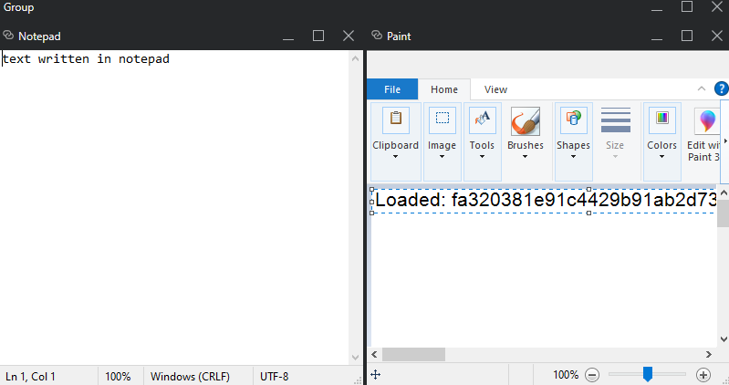
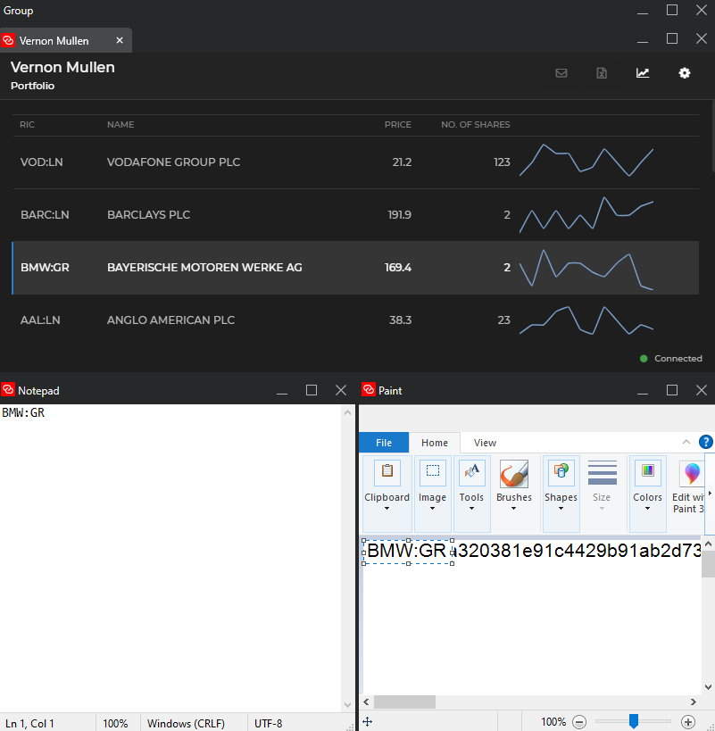

# io-connect-anything

This repo contains a simple .net framework console application demonstrates glueifying of 3rd party applications - in this case Notepad and Paint.

### Notes:

- The applications are launched with a channel support and controlled by the host app, they can be saved, restored.
- The interprocess communication to the apps is done via window messages and windows clipboard.
- LambdaApp is a simple lambda implementation of the IGlueApp nomenclature to ease the implementation
- The main logic is inside the child factories : see _glue.AppManager.RegisterAppFactoryAsync_

## Images:

### You can launch any app and stick it in another io-connect group, with channel support and consume/publish any data.

### The apps can be then restored with the appropriate saved context.

